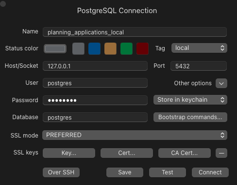

# Planning Applications

## Dependencies

We are using [uv](https://docs.astral.sh) to manage our python dependencies in this project. To get started with uv, following their [setup guide](https://docs.astral.sh/uv/getting-started/installation).

## Project layout

    mkdocs.yml    # The configuration file.
    docs/
        index.md  # The documentation homepage.
        ...       # Other markdown pages, images and other files.

## Getting up and running as a new developer

1. Download Docker if you haven't already

2. Clone the repo

3. Run `cp .env.example .env` to create a new .env file.

4. Create a Zyte account and paste your API key into the .env file.

5. Run `make reset_db` to set up a fresh postgres database.

You should see something like the following output eventually:

```
database   | 2024-12-28 14:33:31.524 UTC [1] LOG:  database system is ready to accept connections
```

6. Connect your database to a GUI



7. There are two ways to run the scraper:

### Running the scraper in Docker

If you want to test the scraper end to end you probably want to run it in a Docker container.

To do this, set `POSTGRES_HOST=db` in the .env file.

Then run `make run lpa=<LPA_NAME>` to run the scraper.

### Running scraper in Docker with a separate database

Change your your POSTGRES_HOST from 127.0.0.1 to host.docker.internal in the .env file.

Then run:

```bash
docker-compose build scraper

docker-compose run --rm --no-deps scraper --lpas-from-earliest sheffield westminster cambridge
```

### Running the scraper outside of Docker

If you are actively developing, you probably don't want to have to rebuild the scrapy container every time you make a change.

That's okay, because you can still run the scraper outside of the container, but keep it writing to the database inside.

To do this, set `POSTGRES_HOST=localhost` in the .env file.

Then run `uv run scrapy crawl <LPA_NAME>` to run the scraper.

## Documentation

We are using [mkdocs](https://www.mkdocs.org/) to build the documentation site.

### Commands

- `mkdocs serve` - Start the live-reloading docs server.
- `mkdocs build` - Build the documentation site.
- `mkdocs -h` - Print help message and exit.
